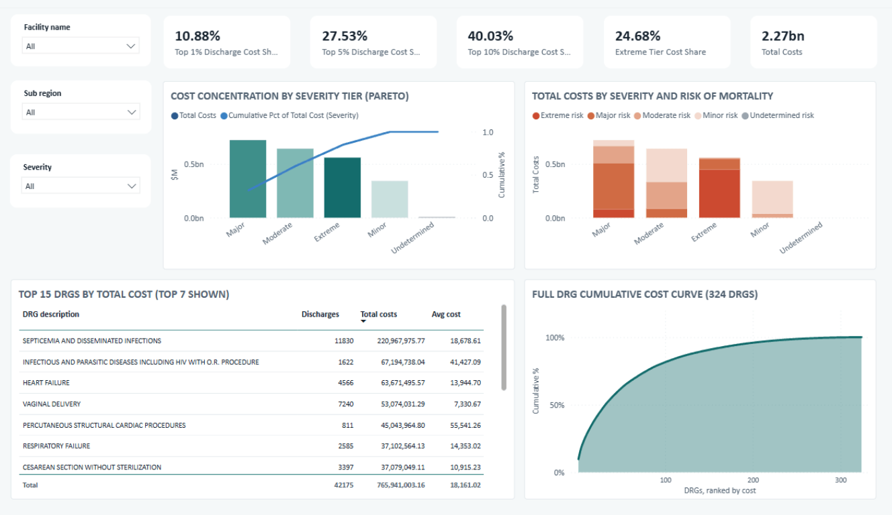
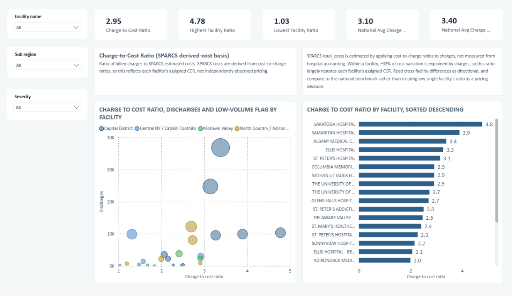
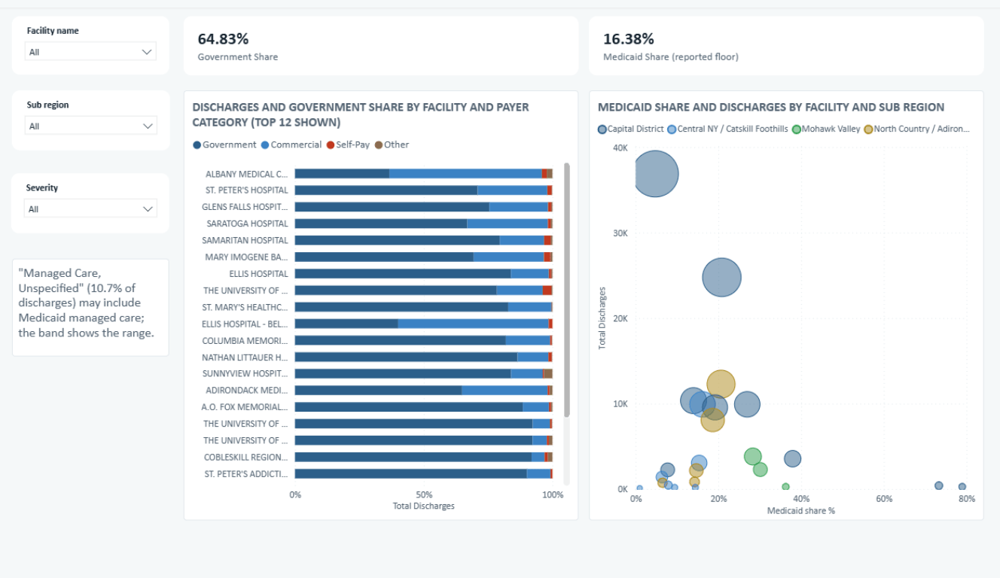
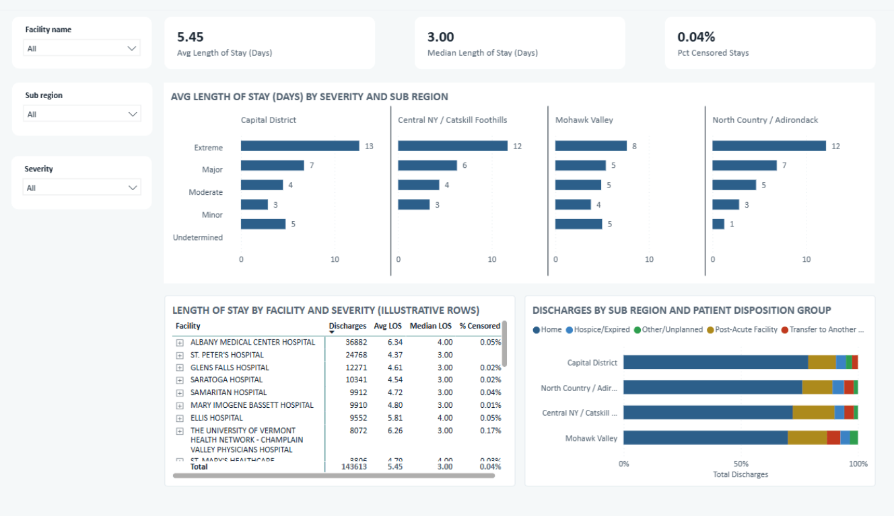
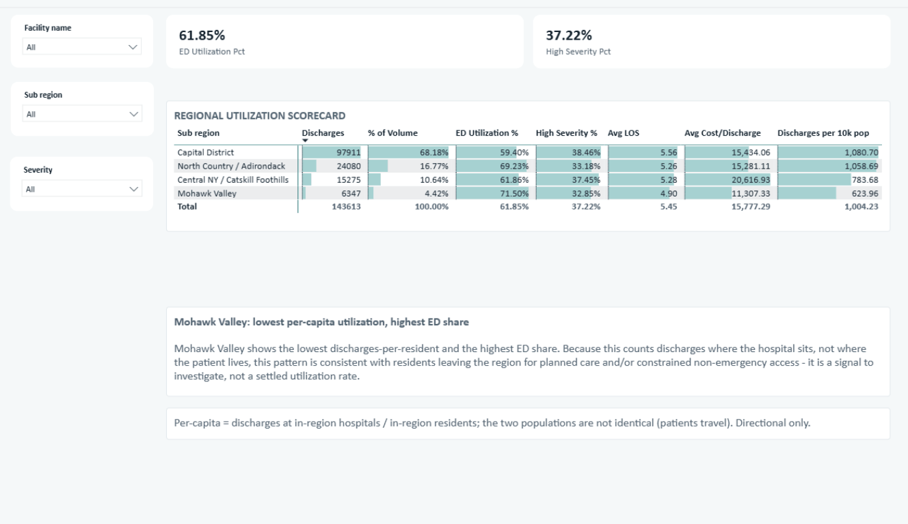

# Healthcare Operations & Finance Dashboard (Insurer's View)

An analytics project on real, de-identified 2024 hospital discharge data for
one New York region, looked at the way a health insurer would look at it:
where cost concentrates, how exposed each hospital is to Medicaid, and which
small rural hospitals a region cannot afford to lose, rather than a hospital's
own revenue dashboard.

> **Report philosophy: this README stays concise.** It's the front door, not
> the full working record. All of the "why" (regional context, data-quality
> findings, and the reasoning behind every choice) lives in
> `docs/project_context.md` and `docs/decisions.md`. If you want the deep
> version, start there.

> **Data:** real, publicly available, de-identified NY State SPARCS hospital
> discharge records (no PHI) for the `Capital/Adirondacks` region, 2024:
> 143,613 rows across 24 facilities in 14 counties. See
> `docs/project_context.md` for the full regional profile and source detail.

---

## What this demonstrates

- **Working with real, messy, provided data**: sourcing from a public
  government API, profiling for quality issues, and documenting cleaning
  decisions rather than starting from a clean synthetic generator.
- **SQL depth**: staging → dimensions → facts → marts, using CTEs, window
  functions, safe division, and multi-table joins.
- **Dimensional modeling**: a star schema built around a real, non-trivial
  grain (one row per discharge) with no natural unique key.
- **Power BI**: a curated data model, DAX measures, and a dashboard built
  around payer-relevant KPIs (cost concentration, payer mix, charge-to-cost
  ratio, utilization).
- **Engineering practice**: reproducible pipeline, clear folder structure,
  consistent naming, a data dictionary, and a logged record of decisions.

## Business questions answered

*(Locked 2026-07-07: framed from a health insurer's perspective; full
rationale in `docs/project_context.md` §4.)*

1. Where is cost concentrated? What share of total spend comes from the
   highest-severity tier of cases, and which DRGs/conditions drive it?
2. What does the charge-to-cost ratio look like by facility, and does it vary
   between the academic center, mid-size community hospitals, and small rural
   facilities?
3. What's the payer-mix exposure by facility and county, which facilities
   are most Medicaid-concentrated, and how does that overlap with facilities
   most likely to be financially distressed?
4. Does length of stay differ by facility size/location for comparable
   severity, and what would that imply about rural post-acute access?
5. How does utilization (volume, severity mix, ED share) differ between the
   urban core and the rural periphery, and what would that mean for network
   design?

---

## The dashboard

Six pages, each answering one locked business question, built on live DAX
over the shared star schema so every slicer (facility, sub-region, severity)
filters every page at once.

**Executive Summary — Facility Risk Score**

Ellis Hospital and Nathan Littauer Hospital tie for the highest risk score
(68.5) among the 19 general-acute facilities, at real volume, not a
low-n artifact.

**Q1: Cost Concentration**

The top 10% of discharges account for 40% of spend; septicemia alone is a
$221M line item.

**Q2: Charge-to-Cost Ratio**

Regionwide 2.95x, below both national reference points, with a spread from
4.78x (Saratoga) to 1.03x (O'Connor).

**Q3: Payer Mix and Medicaid Exposure**

Medicaid exposure is reported as a band (16.4% floor to 27.1% ceiling), not a
single point estimate, since a large "Managed Care, Unspecified" bucket can't
be split precisely.

**Q4: Length of Stay by Facility and Severity**

Median stay is 3 days; the sickest patients at the academic center stay far
longer than the sickest patients in rural sub-regions.

**Q5: Urban vs. Rural Utilization**

Mohawk Valley shows the lowest per-capita utilization and the highest ED
share, a signal of constrained non-emergency access, not a settled finding.

---

## Architecture

```
data/raw/*.csv        ->   stg_discharges   ->   dim_* + fact_discharges   ->   mart_*   ->   Power BI
 (SPARCS extract,          (type & clean,        (star schema: 6 dims,          (analysis-       (dashboard)
  fetched/downloaded)       1 view)                grain = 1 discharge)          ready)
```

- **Engine:** DuckDB (PostgreSQL-style SQL, zero setup, single file).
- **Grain:** `fact_discharges` = one hospital discharge (143,613 rows).
- **Dimensions:** `dim_facility`, `dim_drg`, `dim_mdc`, `dim_diagnosis`,
  `dim_procedure`, `dim_payer`. No `dim_date` (see `docs/data_dictionary.md`
  for why). Full ER diagram there too.
- **Marts:** six pre-aggregated tables, one per locked business question
  (severity cost concentration, DRG cost concentration, facility financials,
  payer mix by facility, LOS by facility/severity, regional utilization);
  see `docs/data_dictionary.md` and `sql/04_marts/`.
- **Validated:** pipeline runs end-to-end with zero orphan foreign keys and
  fact row count matching the raw extract exactly (143,613 = 143,613).

## How to reproduce

From the project root:

```bash
pip install duckdb

# 1) get the raw data: either run the fetch script (needs normal internet
#    access) or use the already-downloaded file already sitting in data/raw/
python3 src/fetch_data.py

# 2) (optional) re-run the data-quality profile that drove docs/decisions.md
python3 src/profile_data.py

# 3) build the warehouse and export dims/fact/marts (data/processed/*.csv)
python3 src/run_pipeline.py

# 4) open Power BI Desktop and follow docs/powerbi_guide.md (current: rewritten
#    against the real SPARCS star schema; the full six-page dashboard was built from it)
```

## Repository layout

```
healthcare-ops-finance/
├── README.md
├── .gitignore
├── src/
│   ├── fetch_data.py        # reproducible pull from the NY SPARCS API
│   ├── profile_data.py      # data-quality profile (nulls, duplicates, censoring checks)
│   └── run_pipeline.py      # runs the SQL layers, validates, exports dims/fact/marts
├── sql/
│   ├── 01_staging/          # type-cast & clean the raw extract (stg_discharges view)
│   ├── 02_dimensions/       # dim_facility, dim_drg, dim_mdc, dim_diagnosis, dim_procedure, dim_payer
│   ├── 03_facts/            # fact_discharges
│   └── 04_marts/            # 6 marts, one per locked business question
├── data/
│   ├── raw/                 # sparcs_inpatient_discharges_2024.csv (gitignored, re-fetchable)
│   ├── interim/              # warehouse.duckdb (gitignored)
│   └── processed/            # exported dims/fact/marts for Power BI (committed)
├── powerbi/                 # .pbix dashboard file
├── docs/
│   ├── project_context.md   # regional context, first-look findings, locked questions
│   ├── data_dictionary.md   # every table/column, star schema, ER diagram
│   ├── decisions.md         # every assumption and choice, dated
│   ├── powerbi_guide.md     # model relationships, DAX, dashboard layout (current, built from)
│   ├── sources.md           # external citations (dataset, population, benchmarks, CMS designations)
│   └── review_findings_and_fixes.md  # senior review: findings + prioritized fixes, with status board
└── outputs/                 # 6 dashboard page screenshots + HTML mockup
```
