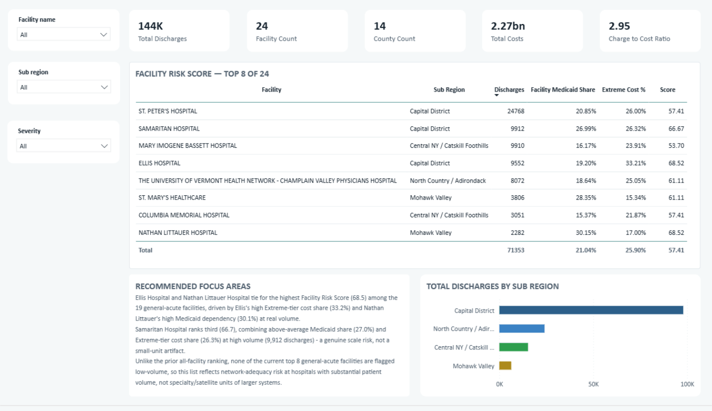

# Healthcare Operations & Finance Dashboard

A six-page Power BI dashboard built on 143,613 real 2024 hospital discharge
records for one New York region, modeled as a validated star schema and read
the way a health insurer's medical-economics team would read it: where cost
concentrates, how exposed each hospital is to Medicaid, and which small rural
hospitals a region cannot afford to lose, rather than a hospital's own
revenue dashboard.

**Detail level:** full technical. The data is real, public, and de-identified
(no PHI), so nothing here is redacted: the fetch script, every SQL layer, the
documented cleaning and modeling decisions, the `.pbix` file, and the write-up
are all in [`../projects/healthcare-ops-finance/`](../projects/healthcare-ops-finance/).

**Stack:** DuckDB (SQL), Power BI, DAX, Python and pandas for independent
validation.



All six dashboard pages: [`../projects/healthcare-ops-finance/outputs/`](../projects/healthcare-ops-finance/outputs/).

---

## The problem

Most portfolio dashboards run on a clean synthetic generator, so every number
comes out tidy by construction. That proves someone can write DAX, not that
they can handle data the way it actually arrives: messy, undocumented,
un-deduplicated, with no natural key and a government agency's idea of a
column name.

The goal: source a real dataset, keep every rough edge, and build the same
disciplined pipeline a payer's analytics team would build on top of it, so
every design choice is a real judgment call instead of a given.

## The approach

Pull real, de-identified hospital discharge records for one region and one
year (NY SPARCS, `Capital/Adirondacks`, 2024, 143,613 rows across 24
facilities) directly from the state's public Socrata API. Reframe the project
from a hospital's own finance view to a health insurer's: cost concentration,
payer-mix risk, and rural network fragility, since that framing forces
different, harder questions than "how much did we bill." Build a real star
schema in DuckDB, validate it end to end, then compute every dashboard measure
as live DAX over that shared model rather than importing six pre-built
tables, so every slicer filters every page at once instead of six static
charts.

## Architecture

```
data/raw/*.csv        ->   stg_discharges   ->   dim_* + fact_discharges   ->   mart_*   ->   Power BI
 (SPARCS extract,          (type & clean,        (star schema: 6 dims,          (analysis-       (6-page
  public API pull)          1 view)                grain = 1 discharge)          ready)           dashboard)
```

Grain is one hospital discharge, with a generated `discharge_key` since the
source has no natural unique key. Six dimensions: `dim_facility`, `dim_drg`,
`dim_mdc`, `dim_diagnosis`, `dim_procedure`, `dim_payer`. No `dim_date`, a
deliberate omission explained below. Six marts, one per locked business
question. The build validates end to end: the fact table's row count matches
the raw extract exactly (143,613 = 143,613), with zero orphan foreign keys.

## The data and the cleaning decisions

Real data was chosen specifically because it does not clean up on its own.
Four judgment calls were made and logged rather than applied mechanically:

- **Censored length of stay.** 57 rows carry the literal text `"120+"`
  (a SPARCS top-coding convention). Floored to `120` with an
  `is_los_censored` flag rather than dropped or silently cast, and surfaced on
  the dashboard as `Pct Censored Stays` (0.04%) so no length-of-stay figure is
  read without its censoring context.
- **Duplicates kept, not deduped.** The file carries no patient or row
  identifier, so 70 rows sitting in exact-duplicate groups cannot be
  distinguished from two real patients who happen to share every coarse
  categorical. Deduping would invent precision the data doesn't support.
- **Payer coalesced.** `primary_payer` is the first non-null of
  `payment_typology_1/2/3`; the raw slots are retained for anyone who needs
  multi-payer detail.
- **A two-ID facility merge, confirmed rather than assumed.** One physical
  hospital appeared under two `permanent_facility_id` values. Merged only
  after ruling out an ownership-change explanation and a distinct-population
  explanation via case-mix comparison; both source IDs are retained for
  traceability.

## Modeling decisions worth noting

- **No `dim_date`.** `discharge_year` is constant across the whole extract
  (2024), so a date dimension would model nothing. Dropped entirely rather
  than built for form's sake, which makes this an explicitly cross-sectional
  design with no time intelligence, stated plainly instead of implied by a
  dimension that does no work.
- **MDC is its own dimension, not a DRG attribute.** Six APR-DRG codes (both
  tracheostomy DRGs, ECMO, and the three "O.R. procedure unrelated to
  principal diagnosis" groups) legitimately span multiple MDCs by grouper
  design. Modeling MDC as an attribute of DRG fanned the fact table out past
  the raw row count; this was caught during the build and fixed by splitting
  MDC into its own dimension.
- **Sentinel rows instead of nullable keys.** `dim_procedure` carries a
  `"NONE"` row for the 38.7% of stays with no procedure, `dim_payer` a
  `"Unknown"` row, so every foreign key on the fact table stays non-nullable.

## What the dashboard says

Framed from a payer's perspective across five locked business questions:


Cost is sharply concentrated, and two independent cuts of the data agree: the
highest-severity tier is under 10% of admissions but drives 24.7% of cost,
and ranking all 143,613 discharges individually says it harder, the top 10%
of admissions account for 40% of spend, the top 1% for 11%. Septicemia and
serious infections alone is a $221M line item, the single largest cost
driver in the region. Regionwide, hospitals bill about $2.95 in charges for
every $1 of estimated cost, below both national reference points, with a
spread from roughly 4.8x at the high end to near 1:1 at the low end.
Government payers cover about 65% of discharges, and once the region's large
"managed care, unspecified" bucket is accounted for, Medicaid exposure is
more realistically around 24% (a documented band of 16.4% to 27.1%, not a
single point estimate), concentrated hardest at the small rural facilities
least able to absorb a funding shock. Combining Medicaid dependency, case
complexity, and size into one risk signal puts two small rural hospitals,
Ellis and Nathan Littauer, at the top of the list an insurer would watch
first to be sure the region keeps enough hospital coverage.

## Correctness engineering

Every headline measure is live DAX over the shared star schema, with the six
marts loaded unrelated, as a known-correct validation reference only, not the
source of the visuals. Most DAX bugs found during the build were one filter-
context class: a `CALCULATE` filter replacing rather than intersecting
existing context, fixed with whole-table `ALL()`, `KEEPFILTERS` on boolean
filters, and `CROSSFILTER(..., BOTH)` at the measure level. A separate class
came from Power BI's Sort By Column silently breaking `RANKX` over
`ALL`/`ALLSELECTED`; fixed by precomputing ranks as calculated columns,
evaluated once at refresh, outside any visual's filter context. One SQL
fan-out bug in a DRG-cost mart (grouping by the wrong key split six
multi-MDC DRGs across up to 15 rows, 390 rows instead of the correct 324) was
caught by a mockup-versus-live discrepancy and fixed at the source, not
patched in the visual. Every headline KPI was independently re-derived in
Python and pandas from the raw file and stress-tested under multiple slicer
combinations, because every real bug in this project only surfaced under
slicer interaction, not in a single static view.

## Honest limits, stated rather than hidden

A few of the softer numbers are published as ranges with their assumptions
named, instead of single confident figures:

- **Medicaid share is a band.** The "managed care, unspecified" bucket
  (10.7% of discharges) is classified Commercial by default but often carries
  Medicaid managed care in NY. The dashboard shows a floor (16.4%, bucket as
  commercial), a midpoint (23.7%, weighted by NY's published Medicaid MCO
  penetration rate), and a ceiling (27.1%, all-MCO), rather than picking one
  and hiding the uncertainty.
- **Charge-to-cost reflects assigned cost ratios, not pricing behavior.**
  SPARCS `total_costs` is itself estimated by the state from charges, so a
  regression check showed within-facility log-charge explains a median 92% of
  the variance in log-cost. The ratio is reported as directional and
  benchmarked against national reference points, never as proof of one
  facility's pricing decision.
- **Per-capita utilization mixes two populations**, since patients cross
  county lines to reach a facility. Kept explicitly as a hypothesis to
  investigate, not a settled finding.
- **The facility risk score is scoped and flagged.** Equal weighting across
  three components is a documented default, not a tuned model. The ranking
  is restricted to 19 general-acute facilities (specialty and satellite units
  excluded by actual CMS designation, not by size), and facilities under
  1,000 discharges carry a small-n flag.

## What this demonstrates

The full analyst stack on real, unclean, public data: sourcing from a
government API, profiling for quality issues and logging every cleaning
decision, dimensional modeling with a genuinely non-trivial grain, DAX and
Power BI dashboard design built around locked business questions, and an
engineering discipline (validation, independent re-derivation, honest
uncertainty ranges) that a health insurer's own analytics team would
recognize. Not a chart built to look finished, an analysis built to survive
someone else checking it.
