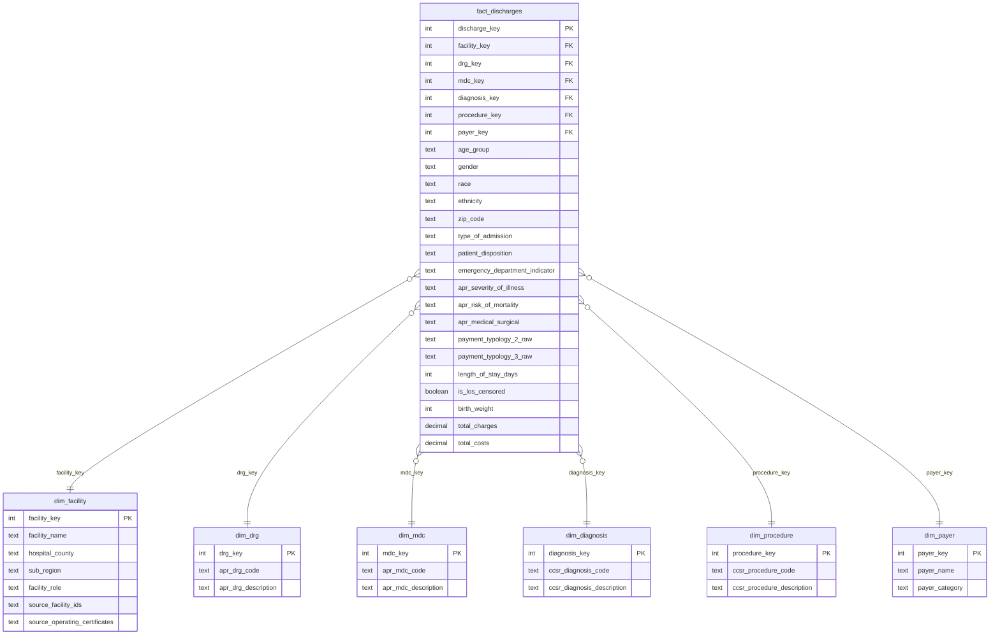

# Data Dictionary

All data is real, publicly available, de-identified hospital discharge data
from NY State SPARCS (no PHI). Monetary values are in USD. Scope: discharge
year 2024, `health_service_area = 'Capital/Adirondacks'`. Full regional and
sourcing context: `docs/project_context.md`. Full reasoning behind every
non-obvious choice below: `docs/decisions.md`.

---

## Raw source (`data/raw/sparcs_inpatient_discharges_2024.csv`)

143,613 rows, 33 columns, one row per hospital discharge (inpatient stay).
Source: [NY SPARCS 2024, Capital/Adirondacks region](https://health.data.ny.gov/Health/Hospital-Inpatient-Discharges-SPARCS-De-Identified/sf4k-39ay/about_data),
pulled via the state's public Socrata API. Null % below is measured directly
against the profiled file.

| Column | Type (as published) | Null % | Description |
|---|---|---|---|
| `health_service_area` | text | 0% | Constant `"Capital/Adirondacks"`; the scope filter used to extract this file |
| `hospital_county` | text | 0% | County **of the hospital facility**, not the patient's residence. 14 distinct values |
| `operating_certificate_number` | text (zero-padded) | 0% | The facility's NYS operating license. One certificate can cover multiple physical sites (e.g. a main hospital + an attached recovery center), not a 1:1 facility key |
| `permanent_facility_id` | text (zero-padded, 6-digit) | 0% | The physical-site identifier. 25 raw distinct values, resolves to 24 real facilities; see facility note below |
| `facility_name` | text (upper-case) | 0% | Human-readable facility name. 24 distinct values |
| `age_group` | text | 0% | Banded for privacy: `0-17`, `18-29`, `30-49`, `50-69`, `70 or Older` |
| `zip_code` | text | 1.6% | 3-digit truncated patient ZIP (privacy masking), or the literal code `"OOS"` (out of state, 1.8% of rows); genuine blanks are a separate, smaller category from `"OOS"` |
| `gender` | text | 0% | `F`, `M`, or `U` (unknown) |
| `race` | text | 0% | `White`, `Other Race`, `Black/African American`, `Multi-racial` |
| `ethnicity` | text | 0% | `Not Span/Hispanic`, `Spanish/Hispanic`, `Unknown` |
| `length_of_stay` | text → integer | 0% | Days in hospital. Numeric 1-119 for almost all rows; 57 rows are the literal text `"120+"` (SPARCS's own censoring of very long stays); see staging note below |
| `type_of_admission` | text | 0% | `Emergency`, `Elective`, `Urgent`, `Newborn`, `Trauma`, `Not Available` |
| `patient_disposition` | text | 0% | Discharge destination (home, skilled nursing, expired, hospice, etc.), 19 distinct values |
| `discharge_year` | text | 0% | Constant `2024` in this extract; no year-over-year trend is possible from this file alone |
| `ccsr_diagnosis_code` / `ccsr_diagnosis_description` | text | 0% | Clinical Classifications Software Refined diagnosis category. 435 distinct codes |
| `ccsr_procedure_code` / `ccsr_procedure_description` | text | 38.7% | Procedure category, if any procedure was performed. Blank is expected (no procedure), not missing data |
| `apr_drg_code` / `apr_drg_description` | text | 0% | All Patient Refined DRG, the primary case-grouping classification. 324 distinct codes |
| `apr_mdc_code` / `apr_mdc_description` | text | 0% | Major Diagnostic Category (broader grouping than DRG). 26 distinct values |
| `apr_severity_of_illness_code` / `apr_severity_of_illness` | text | 0% | Clinical severity tier: `Minor`, `Moderate`, `Major`, `Extreme`, `Undetermined` |
| `apr_risk_of_mortality` | text | 0% | Mortality risk tier, same 5-value scale as severity |
| `apr_medical_surgical` | text | 0% | `Medical`, `Surgical`, or `Not Applicable` |
| `payment_typology_1` | text | 0.04% | Primary payer for the stay. 9 distinct values (Medicare, Medicaid, Blue Cross/Blue Shield, Managed Care Unspecified, Private Health Insurance, Self-Pay, Federal/State/Local/VA, Miscellaneous/Other, Department of Corrections) |
| `payment_typology_2` | text | 67.7% | Secondary payer, if any. Blank is expected (single-payer stay) |
| `payment_typology_3` | text | 97.8% | Tertiary payer, if any. Blank is expected |
| `birth_weight` | text → integer | 91.5% | Populated only for newborn cases. Range 400-7,500 grams among populated rows |
| `emergency_department_indicator` | text | 0% | `Y` or `N`, whether the stay originated in the ED |
| `total_charges` | text → decimal | 0% | Billed amount. Range $121.05-$8,376,910.43. Cleanly numeric as published (no stray characters) |
| `total_costs` | text → decimal | 0% | **Not a hospital's actual accounting cost.** SPARCS estimates this by applying cost-to-charge ratios (CCRs) to `total_charges`; within a facility, charges explain a median 92% of cost variance (R²), so an aggregate charge-to-cost ratio largely restates the facility's assigned CCR rather than independently observed pricing (see `docs/decisions.md`, "Page 3 reframed..." 2026-07-10, and Page 3's own caveat text box). Range $31.46-$3,290,735.98. Cleanly numeric as published |

**Facility identity note:** `permanent_facility_id` has 25 raw distinct
values against 24 real facilities. Alice Hyde Medical Center (Franklin
County) appears under two IDs (`000325`/certificate `1624000`, 445 rows, and
`015485`/certificate `1624700`, 390 rows) with near-identical clinical case
mix between the two, resolved as one physical hospital in the staging layer
(see `docs/decisions.md`, "Alice Hyde Medical Center: two facility IDs
merged").

**Row-level ambiguity note:** this file carries no patient or row identifier
of any kind. 70 rows sit in exact full-row duplicate groups; these are kept
as-published rather than deduplicated, since an "exact duplicate" here cannot
be distinguished from two different real patients sharing every recorded,
coarse categorical field (see `docs/decisions.md`).

---

## Staging-layer transformations (planned, `sql/01_staging/`, not yet built)

These are the locked cleaning rules the staging layer will implement; listed
here so the eventual SQL has a written spec to build against, before the
star schema itself is designed.

| Raw column(s) | Staged as | Rule |
|---|---|---|
| `operating_certificate_number`, `permanent_facility_id` | kept as text | Never cast to numeric, zero-padding is meaningful |
| `permanent_facility_id` (Alice Hyde's two values) | merged | Both map to one `facility_name`-keyed record; both source IDs retained as a note on that record |
| `length_of_stay` | `length_of_stay_days` (integer) + `is_los_censored` (boolean) | `"120+"` → `120` with the flag set `true`; all other values cast directly with the flag `false` |
| `payment_typology_1/2/3` | `primary_payer` (text) | Coalesce: first non-null of the three. Raw columns retained alongside for anyone who needs the original slot-by-slot detail |
| `total_charges`, `total_costs` | `total_charges` / `total_costs` (decimal) | Direct cast, already clean, no transformation needed beyond typing |
| `zip_code` | kept as text | `"OOS"` and true blanks both preserved as distinct categorical states, not coerced to a number |
| (full row) | kept, no dedup | No row-removal step; 70 rows sit in exact-duplicate groups (36 would be removed by a keep-first dedupe) |

Note: this staging table describes the rules that were locked before the SQL
was written. The actual built staging view lives in `sql/01_staging/01_staging.sql`
and implements every rule above exactly.

---

## Star schema (`data/processed/`, built and validated)

**Grain of the fact table:** one row per hospital discharge, matches the
raw file's own grain directly, no aggregation needed. There is no natural
key (no patient/row ID in the source), so `discharge_key` is a generated
surrogate.

**No `dim_date`.** This public file carries no exact admission/discharge
date, only the constant `discharge_year = 2024`. A date dimension would have
nothing to key on, and `discharge_year` itself is dropped from the model
entirely (100% constant, zero analytical value as a column). The single-
year scope is stated once, in the README and dashboard, instead of being
carried through every table.

**Demographics stay flat on the fact table.** `age_group`, `gender`, `race`,
`ethnicity`, `zip_code` describe the discharge, not a stable patient entity
(there is no patient ID to hang a dimension off of), so they're kept as
fact columns rather than pulled into a separate dimension.

**MDC is its own dimension, independent of DRG.** Six APR-DRG codes (004,
005, 009, 950, 951, 952: tracheostomy/prolonged ventilation, ECMO, and
"O.R. procedure unrelated to principal diagnosis") legitimately span
multiple MDCs by APR-DRG grouper design. Treating MDC as a DRG attribute
caused a real join fan-out during the build (see `docs/decisions.md`), so
`dim_mdc` is modeled and joined independently.

### Dimensions

- **dim_facility** (24 rows): grain is one physical hospital. `sub_region`
  is the derived grouping from `docs/project_context.md` (Capital District,
  North Country/Adirondack, Central NY/Catskill foothills, Mohawk Valley).
  Alice Hyde Medical Center's two source IDs are merged here;
  `source_facility_ids`/`source_operating_certificates` retain both raw
  values as a traceability note. **`facility_role`** (added 2026-07-10, see
  `docs/decisions.md` and `docs/review_findings_and_fixes.md` Fix 3):
  five-value classification grounded in each facility's actual CMS
  designation, not size — `Academic Medical Center` (1), `Community Acute
  (PPS)` (8), `Critical Access Hospital` (6), `Sole Community Hospital` (4),
  `Specialty / Satellite` (5). Used to exclude the five non-general-acute
  units (rehab, addiction, standalone women's/OB, named satellite campuses)
  from the Page 1 Facility Risk Score ranking so it compares like with like;
  sources for the CAH/SCH designations are in `docs/sources.md` §6.
- **dim_drg** (324 rows): grain is one APR-DRG code. Does not carry MDC as
  an attribute; see the MDC note above.
- **dim_mdc** (26 rows): grain is one Major Diagnostic Category, modeled
  independently of DRG.
- **dim_diagnosis** (435 rows): grain is one CCSR diagnosis code.
- **dim_procedure** (294 rows: 293 real CCSR procedure codes plus one
  `"NONE"` sentinel row): grain is one CCSR procedure code. The sentinel row
  means `procedure_key` on the fact is never null even though 38.7% of
  discharges have no procedure, a standard "no value" dimension-row
  technique, avoiding a nullable FK.
- **dim_payer** (10 rows: 9 real `payment_typology_1` labels plus
  `"Unknown"` for the 26 truly-blank rows): grain is one coalesced
  primary-payer label (see staging rule above). `payer_category` groups
  payers into `Government` (Medicare, Medicaid, Federal/State/Local/VA,
  Department of Corrections), `Commercial` (Blue Cross/Blue Shield, Private
  Health Insurance, Managed Care, Unspecified), `Self-Pay`, and `Other`
  (Miscellaneous/Other, Unknown). **Caveat:** `Managed Care, Unspecified`
  is classified `Commercial` by default, but this label can sometimes
  represent Medicaid managed-care plans in SPARCS data. Question #3
  (Medicaid exposure) does show this category is large (10.71% of
  discharges) — **revisited 2026-07-10**, see `docs/decisions.md` ("Fix 1
  finished: Medicaid sensitivity band added to Page 4") and the Page 4
  Medicaid Share (reported floor) card, sensitivity-band table, and caption,
  which now surface the 16.4%-27.1% range this ambiguity implies rather than
  treating the reported 16.38% floor as the only Medicaid figure.

### Fact

- **fact_discharges** (143,613 rows): grain is one hospital discharge.
  `payment_typology_2_raw`/`_3_raw` retain the original secondary/tertiary
  payer labels (not modeled as their own dimension, see
  `docs/decisions.md` for why a full payer bridge table was scoped out) for
  anyone who needs multi-payer detail beyond the primary/`dim_payer` view.

### Not built (scoped out for now)

- A payer *bridge table* modeling all payers per stay (not just the
  coalesced primary), would properly handle the ~30% of stays with 2+
  payers, but adds real complexity for a business-question set that only
  needs primary-payer exposure. Documented as a possible extension, not a
  gap that blocks the locked questions.
- Small reference dimensions for `type_of_admission`/`patient_disposition`,
  kept as flat fact attributes since they're single labels with no
  additional descriptive attributes of their own (no meaningful hierarchy
  to model).

---

## Reference table added in Power BI (not part of the star schema)

**`_SubRegionPopulation`** (4 rows, manually entered in Power BI, not sourced
from `data/processed/`): grain is one sub-region.

| Column | Type | Description |
|---|---|---|
| `sub_region` | text | One of the four sub-regions used throughout the model (Capital District, North Country/Adirondack, Central NY/Catskill Foothills, Mohawk Valley) |
| `population` | integer | Census Bureau/ACS county-summed population estimate, 2023-2024 vintage; see `docs/project_context.md` §2 and `docs/decisions.md` for sourcing and the county-level breakdown |

Related by a single relationship, `dim_facility[sub_region]` (many) →
`_SubRegionPopulation[sub_region]` (one), active. Exists only to support the
`Sub-Region Population` and `Discharges per 10k Population` measures (Page 6);
it is a small denominator lookup, not a dimension in the discharge-grain
sense, so it is kept outside the ER diagram above.

---

## Build status

Built and validated via `src/run_pipeline.py`: `fact_discharges` row count
matches the raw extract exactly (143,613), zero orphan foreign keys across
all six dimensions, and all six marts (one per locked business question)
spot-checked. Full build history: `docs/decisions.md`, section "SQL layer
build."
