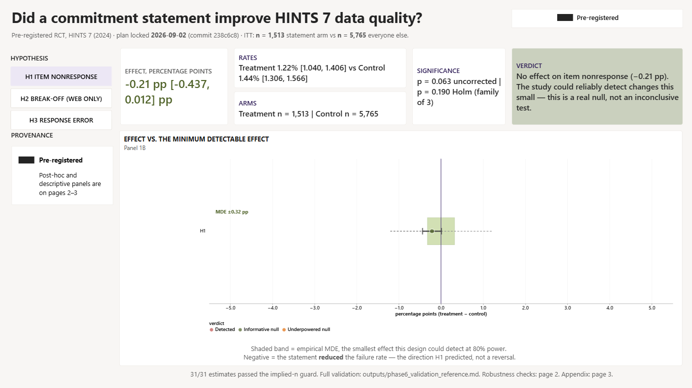
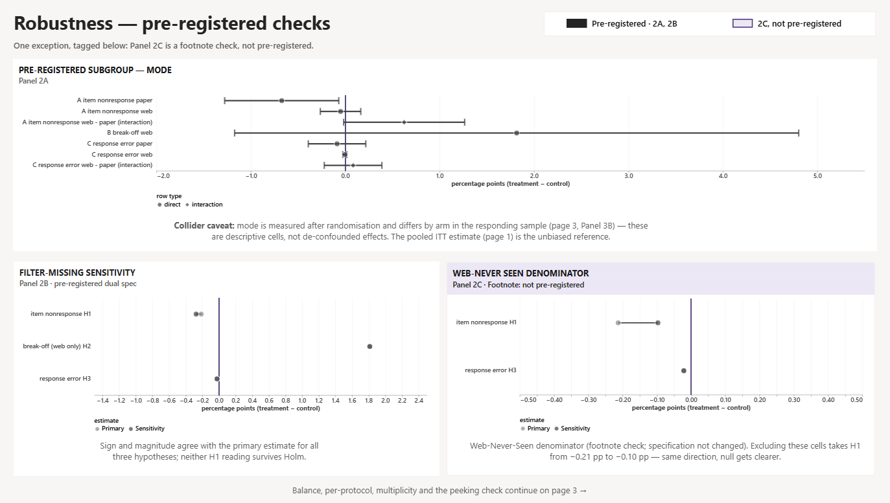
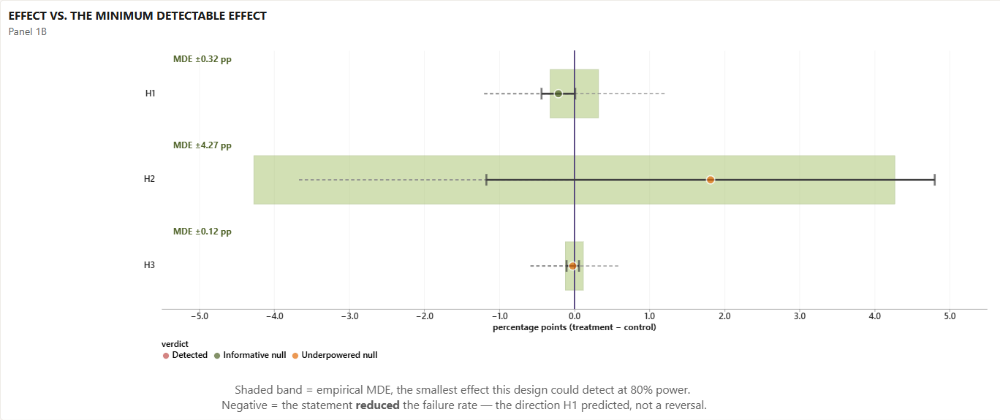
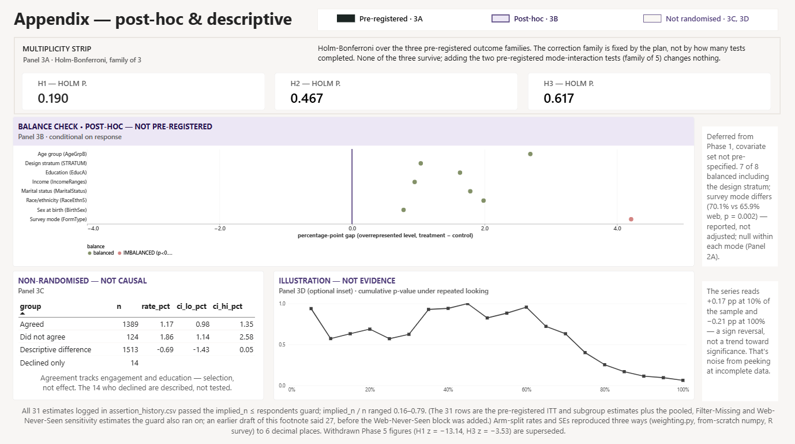

# The Data Quality Question a Federal Survey Left Unanswered

In 2024 the National Cancer Institute ran a randomized experiment inside a
national health survey. Respondents were asked to commit to answering
completely and accurately. NCI published whether that changed how many
people responded. It never published whether it changed how well they
answered.

**Data:** HINTS 7 (2024), National Cancer Institute, public use file, US
federal public domain. n = 7,278, 515 columns, 368 analyzable survey items.

**Stack:** Python (pandas, numpy) for the analysis pipeline and the
survey-weighting engine, R (`survey` package) for an independent statistical
cross-check, Power BI for the scorecard.



---

## The problem

NCI's methodology report says what the commitment statement was for: it was
"intended to improve response data quality by, for example, reducing item
nonresponse overall and break offs on web." The report then published one
number, household response rate by arm (27.7 percent treatment versus 27.2
percent control, not significant), and stopped.

Whether more households opened the survey is a different question from
whether the people who answered it answered carefully. That second
question, item nonresponse, break-off, and response error, does not appear
in the report. Both the randomization flag and the outcome codes needed to
answer it are sitting in the public file NCI already released.

## The approach

Write the analysis plan down before opening the data:

- Hypotheses and their predicted direction
- Exact outcome definitions
- Statistical tests and the multiple-comparison correction
- The minimum detectable effect

Commit it to public version control with a timestamp, then run it, blind to
arm assignment until the analysis phase itself. Effects were estimated
intention-to-treat, with survey-weighted per-respondent rates and jackknife
standard errors, then checked per-protocol (non-causal) as a secondary read.

## Architecture

```
hints7_public.rda   ->   analysis_frame.parquet   ->   weighting.py (jackknife,    ->   analysis.py   ->   outputs/
(NCI raw file,            (one row per respondent,      50 replicate weights,           (ITT, per-         (tables, figures,
 7,278 x 515)              72 cols, 3 outcome              NCI-specified 0.98            protocol, MDE,      Power BI
                           families built)                 coefficient)                  Holm correction)    scorecard)
```

Every estimate routes through one weighting function, unmodified across the
whole build. An `implied_n <= n_respondents` guard runs on every estimate
and halts the pipeline if a standard error implies more independent
observations than there are people in the group.

## Finding 1: every defect found pointed the same direction

Four independent bugs surfaced in this build, in four files, written at
four different times. Every one made a null result look like a finding.
Not one made a result look weaker.

- **Item-level variance.** The first analysis run reported two large,
  significant effects. Both were wrong: the code counted every survey item
  on every form as an independent observation, roughly 2.4 million of
  them, instead of one per respondent. Confidence intervals came out about
  twenty times too narrow.
- **The jackknife `/50` bug.** The weighting engine had a stray division by
  the replicate-weight count, understating every error bar sevenfold.
  Caught by testing it against a synthetic dataset with a hand-computed
  answer, not by the published-percentage comparison that let it through
  the first time.
- **Prose-matched dashboard color.** A draft spec would have colored two
  nulls the same as a real effect, because it picked the color by
  searching the verdict sentence for the word "detected," and the null
  sentence read "the experiment could not have detected it."
- **Uncorrected-p labeling.** Inside the fix for that bug, a fourth
  surfaced: a labeling rule that would have marked a result "detected" on
  the uncorrected p-value against a plan that requires the
  Holm-corrected one.

An error that makes a result look boring gets caught within minutes,
because seeing nothing prompts the question of why. An error that makes a
result look exciting confirms what was hoped for, so it survives
unquestioned. The imbalance is in the checking, not the code, which is why
"be careful" is not a defense against it.

What held here was structural: a plan locked and timestamped before anyone
knew the answer, an executable check that halts on a number too good to be
true, and categorical machine-readable labels in place of English
sentences anywhere a value drives a decision.

The comparison itself is unbiased by construction: it is treatment against
everyone else, and randomization plus the fact that nobody outside the
treatment arm ever saw the statement is what makes "everyone else" a valid
control, not a contaminated mix.

## Finding 2: a federal report's own numbers didn't reconcile

NCI's methodology report gives arm sizes of 2,400 treatment and 4,800
control. The public data file shows 1,513 and 5,765. Those don't reconcile
on any reading.

Settling which was right, before computing a single arm-split statistic,
meant checking the treatment flag's codebook label against a second,
independent variable:

- Everyone flagged treatment had been asked the commitment question.
- Everyone flagged control had not.
- The compliance counts summed exactly to the treatment arm's size (1,389
  yes, 14 no, 110 not ascertained: 1,513).

The flag is correct. The report's own arm-size table is what doesn't add
up, a finding about the data producer's documentation, not about this
analysis.

## Finding 3: the denominator decisions, disclosed

Of 515 columns, 368 are analyzable survey items; the rest are weights,
strata, metadata, and the experiment flags. Every item's inclusion is set
by automated parsing of its value labels, zero hand-made calls on that
boundary. But two real researcher-degrees-of-freedom decisions exist, and
both are named, not hidden.

- **The Filter-Missing code.** Ambiguous enough that the pre-registration
  specifies both a primary and a sensitivity denominator before any
  result was seen.
- **The Web-Never-Seen code.** Surfaced after the frame was built: the
  plan's own denominator table excludes it, and the built frame includes
  it. The ruling was to keep the as-built specification rather than edit a
  definition after seeing results, even though the excluded alternative
  would have made the null read more clearly null (p = 0.55 instead of
  p = 0.06).

Changing a definition after seeing results is the exact move a locked plan
exists to prevent, in either direction.



## Finding 4: the result, and what the experiment could detect

The commitment statement did not measurably improve data quality.

- **Item nonresponse (primary).** Statement 1.22 percent versus control
  1.44 percent, a difference of 0.21 pp, 95 percent CI [-0.44, +0.01] pp,
  p = 0.063 uncorrected, p = 0.19 after the pre-registered Holm
  correction. This is an **informative null**: the smallest effect this
  experiment could reliably detect was about 0.3 pp, below the 1.8 to 4.0
  pp range the locked plan assumed. An effect of the size anyone cared
  about is ruled out, not just undetected.
- **Break-off.** +1.8 pp, p = 0.23. Genuinely underpowered: its MDE (4.3
  pp) exceeds any plausible real effect, so this null is a shrug rather
  than a finding.
- **Response error.** -0.02 pp, p = 0.62. Also underpowered (MDE 0.12 pp).

A sensitivity check on the ambiguous denominator code agrees in sign and
magnitude with the primary result throughout.



## Limitations

- A single survey cycle.
- Self-reported outcomes throughout: item nonresponse and response error
  are proxies for data quality, not direct measures of it.
- Per-protocol results are confounded with engagement and education and
  are reported descriptively, never causally.
- The secondary outcomes' underpowered-null label is a conservative
  convention, not the pre-registered rule: the plan's 3 pp
  informativeness threshold was written for item nonresponse and doesn't
  transfer to a 0.36 percent baseline. Only the primary outcome's verdict
  comes from the locked rule itself.



## What I would do differently

- Specify every denominator edge case, including the one that only became
  ambiguous once the frame existed, before locking the plan rather than
  after.
- Build the guard and the categorical labels into the pipeline from the
  first line of code, not after an incident forced the question of what
  would have caught it.

## What this demonstrates

Analyzing a real randomized experiment end to end: intention-to-treat and
per-protocol estimation, survey-weighted rates with jackknife replicate
standard errors, a minimum-detectable-effect analysis paired with every
null, and a Holm correction across a pre-registered family of tests, plan
locked and publicly timestamped before any outcome was examined.

The generalizable lesson sits underneath the statistics: errors in an
analysis are not evenly distributed by direction. They lean toward
whatever the analyst hopes to find, which means the defense has to be
structural, fixed criteria before the data, executable checks instead of
vigilance, and labels a machine can read instead of sentences it has to
guess at.
